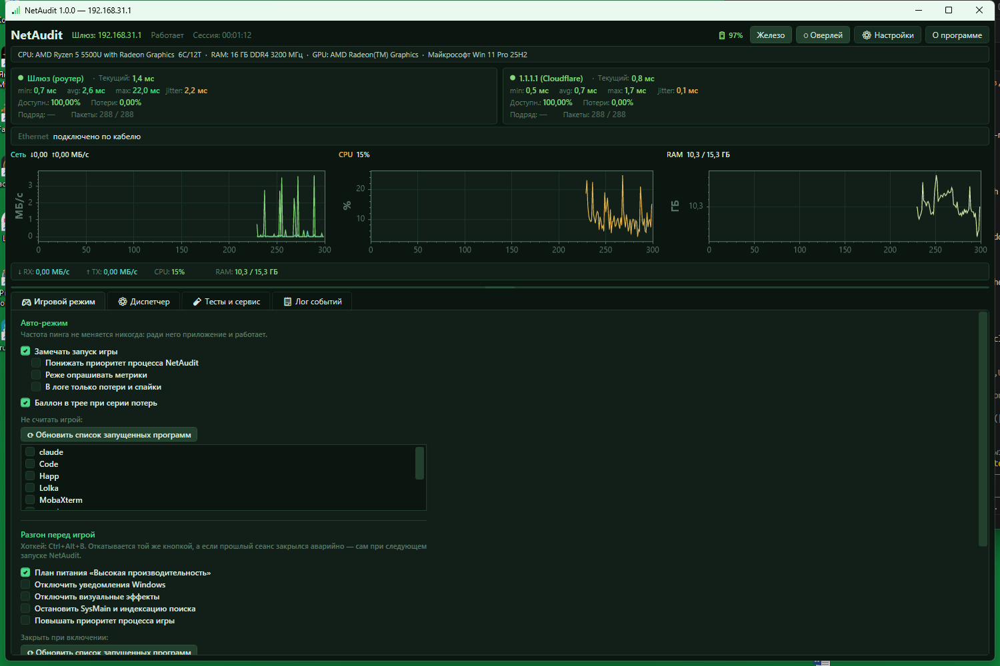
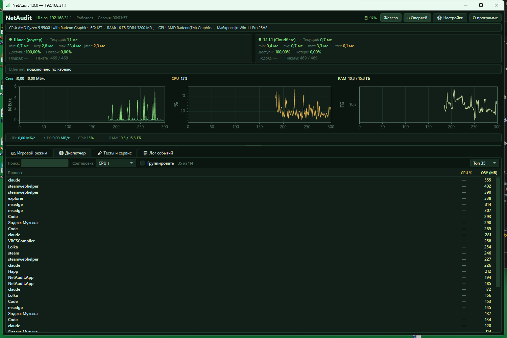
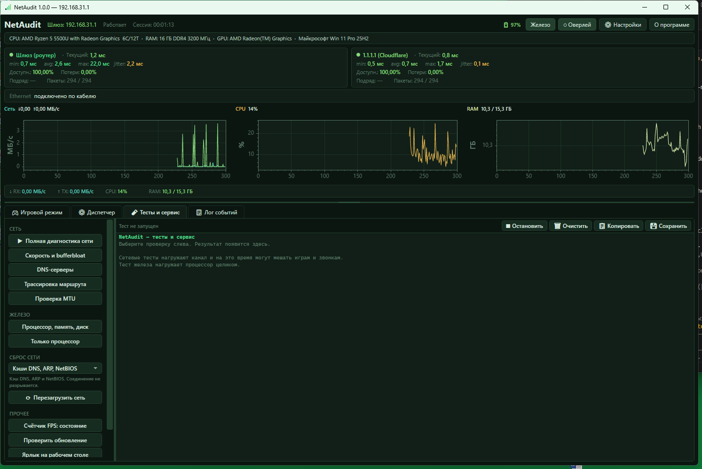
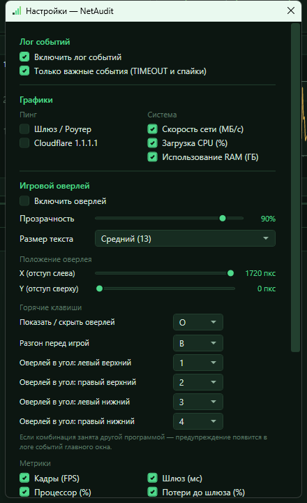
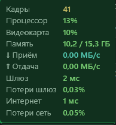

# NetAudit

Локальная утилита для Windows: мониторинг сети и системы в реальном времени
с оверлеем поверх игр. Ничего никуда не отправляет, серверной части нет,
всё работает на вашей машине.

## Скриншоты

| Игровой режим | Диспетчер процессов |
|---|---|
|  |  |

| Тесты и сервис | Настройки |
|---|---|
|  |  |

Игровой оверлей поверх экрана:



## Что умеет

**Постоянный мониторинг**
- Задержка до роутера и до интернета, четыре замера в секунду
- Потери, jitter, доступность, серии потерь подряд
- Загрузка процессора, памяти, сети, видеокарты
- Живые графики с курсором и увеличением области
- Журнал событий с фильтрами и поиском, диспетчер процессов

**Игровой оверлей**
- Полупрозрачная панель поверх игры, полностью клик-сквозная
- Кадры в секунду, задержка, потери, нагрузка на железо
- Настраиваемые горячие клавиши на показ/скрытие и переброс по углам экрана,
  не выходя из игры
- Игровой режим: как только приложение замечает запуск игры, урезает
  собственную нагрузку; программы, которые не должны считаться игрой
  (плеер, стример, редактор), можно исключить вручную из списка процессов
- Баллон в трее при серии потерь подряд во время игры, если окно свёрнуто

**Разгон перед игрой (Game Boost)**
- Одна кнопка или хоткей — и перед стартом игры включаются: план питания
  «Высокая производительность», отключение уведомлений Windows и визуальных
  эффектов, остановка SysMain/WSearch, повышенный приоритет процесса игры,
  закрытие выбранных вручную фоновых программ
- Все изменения обратимы: повторное нажатие или выход из NetAudit
  откатывает систему к прежнему состоянию; если прошлый сеанс закрылся
  аварийно, откат происходит сам при следующем запуске

**Разовые проверки**
- Скорость канала и, что важнее для игр, прирост задержки под нагрузкой (bufferbloat)
- Сравнение DNS-серверов, обнаружение подмены и перехвата
- Трассировка маршрута с разбором, на каком участке набирается задержка
- Поиск MTU — заниженный MTU даёт вылеты из игр при идеальном пинге
- Тест процессора, памяти и накопителя с проверкой на троттлинг

**Сервис**
- Перезагрузка сети без перезагрузки Windows, четыре уровня глубины
- Значок в трее, автозапуск вместе с Windows
- Проверка и установка обновлений в один клик

## Требования

- Windows 10 версии 1809 или новее, Windows 11
- [.NET 10 Desktop Runtime](https://dotnet.microsoft.com/download/dotnet/10.0)
- Права администратора нужны **только** счётчику кадров и сбросу сети —
  в портативной сборке их спросят при каждом обращении к этим функциям.
  Всё остальное работает от обычного пользователя.

## Установка

На выбор — в [Releases](../../releases) есть два варианта:

- **`NetAudit-Setup-vX.X.X.exe`** — обычный установщик (Inno Setup). Ставит
  в Program Files, добавляет ярлыки и запись в «Установка и удаление
  программ», один раз запрашивает права администратора и регистрирует
  задачу в Планировщике заданий — дальше NetAudit запускается сразу с
  правами администратора, без повторного окна UAC при каждом старте.
  Рекомендуется, если планируете пользоваться постоянно.
- **`NetAudit-vX.X.X-win-x64.zip`** — портативная сборка. Распакуйте и
  запустите `NetAudit.App.exe`, ничего не устанавливается. Права
  администратора система будет спрашивать при каждом запуске, если нужен
  счётчик кадров или сброс сети — они единственное, что этого требует.

Если .NET Desktop Runtime ещё не стоит, Windows сама покажет окно с кнопкой
скачать его с официального сайта Microsoft — это встроенное поведение
приложений на .NET, не часть NetAudit.

Сборка без цифровой подписи — при первом запуске Windows SmartScreen может
показать «Windows защитила ваш компьютер». Это стандартное предупреждение
для бесплатных программ без платного сертификата подписи, не признак
проблемы. Нажмите «Подробнее» → «Выполнить в любом случае».

Обновление: приложение проверяет версию само и умеет обновиться в один клик.
Настройки и журналы при этом сохраняются — они лежат в `%LOCALAPPDATA%\NetAudit\`.

## Сборка из исходников

```
dotnet build NetAudit\NetAudit.slnx
```

Релизный архив:

```
powershell -ExecutionPolicy Bypass -File NetAudit\release.ps1 -Version 1.1.0
```

Скрипт соберёт, подпишет (если есть сертификат), упакует в zip, соберёт
установщик через Inno Setup (если найден `ISCC.exe`), посчитает SHA-256
и обновит `version.json`.

## Устройство

| Проект | Назначение |
|---|---|
| `NetAudit.Core` | Пробы, планировщики, диагностика, ETW. Без интерфейса |
| `NetAudit.App`  | Окна WPF, оверлей, трей, настройки |
| `NetAudit.Rtss` | Задел под вывод в оверлей RTSS. Пока заглушка |

## Чего здесь принципиально нет

NetAudit **не внедряется в процесс игры**: ни перехватов DXGI и Present,
ни подгрузки своих библиотек. Античиты расценивают такое вмешательство
как читерство, и расплачивается за это владелец аккаунта, а не автор утилиты.

Кадры считаются по событиям, которые Windows публикует сама через ETW —
тем же способом, что и PresentMon от Microsoft. Для полноэкранного
эксклюзивного режима предусмотрен вывод через RTSS, который хуки ставит сам
и делает это на своих условиях.

## Лицензия

[PolyForm Noncommercial License 1.0.0](LICENSE). Коротко: код открыт,
личное некоммерческое использование — качайте, ставьте, изучайте, меняйте
для себя без ограничений. Коммерческое использование (продажа, встраивание
в платный продукт, конкурирующий сервис) требует отдельного разрешения
от автора.
